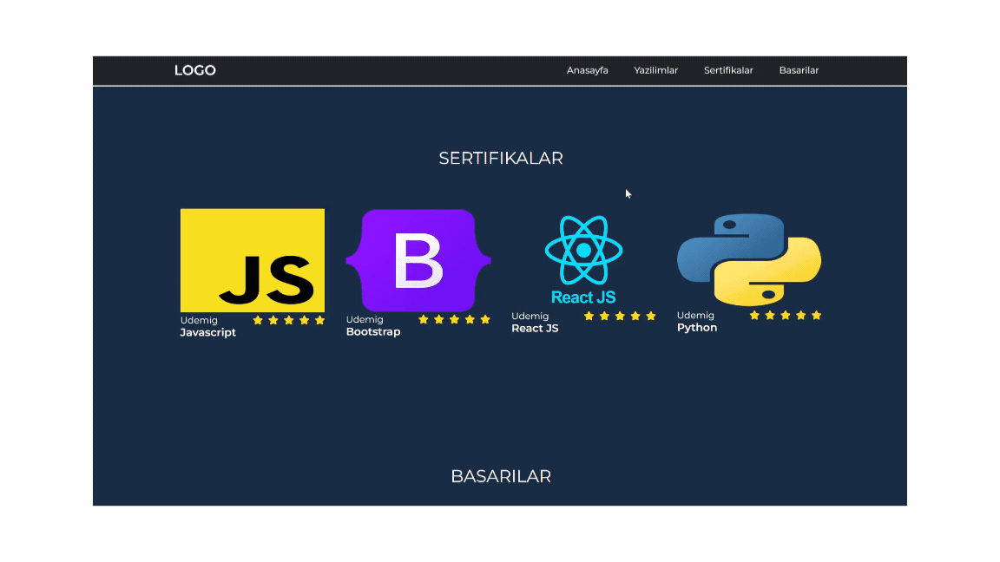

# 🌟 Modern Web Tasarımı: Göz Alıcı ve Erişilebilir Web Siteleri

## Sunum



**Hayalinizdeki web sitesine birkaç adımda ulaşın!** 

Web dünyasında başarılı olmak için doğru araçları ve bilgileri kullanmak şart. Bu proje, modern web tasarımının temellerini sunan etkileyici bir web sitesi sunmaktadır. HTML, CSS ve JavaScript kullanarak, sadece bir web sitesi değil, aynı zamanda kullanıcı deneyimini mükemmelleştirmeyi hedefliyoruz!

## 🚀 Özellikler

- **Hayranlık Uyandıran Tasarım**: Modern estetik ve kullanıcı dostu arayüz ile ziyaretçilerinizi etkileyecek.
- **Tam Duyarlılık**: Her cihazda mükemmel görüntü! Mobil, tablet veya masaüstü—hepsine uyum sağlayın.
- **Geliştirici Dostu**: HTML, CSS ve JavaScript ile sunduğumuz bilgi birikimi ile projelerinizi hızlıca hayata geçirin.
- **Eğitici İçerikler**: Yazılım ve tasarım hakkında bilgi edinmek isteyenler için detaylı rehber ve makaleler.
- **Sertifikalar ve Başarılar**: Öğrendiklerinizi kanıtlayacak sertifikalarla dolu özel bir bölüm.

## 🏁 Başlarken

### Gereksinimler

- **Web Tarayıcısı**: En popüler tarayıcılarla uyumlu. Chrome, Firefox veya Safari kullanabilirsiniz.

### Kurulum

1. Projeyi klonlayın:
   ```bash
   git clone https://github.com/fiartaks/3-Web-Design.git

